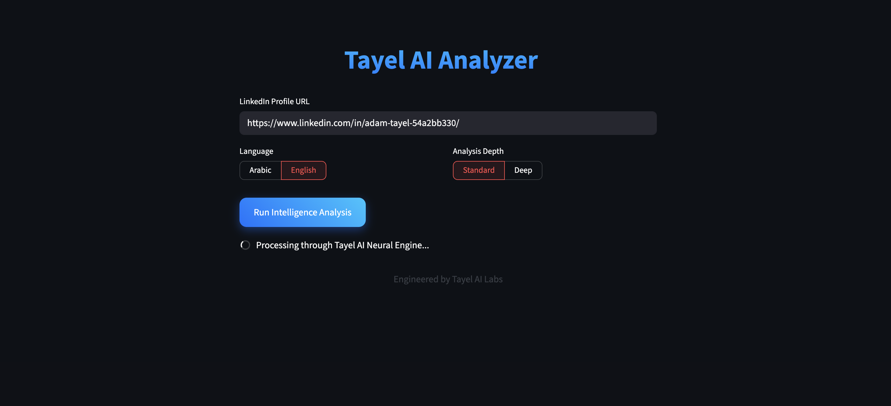
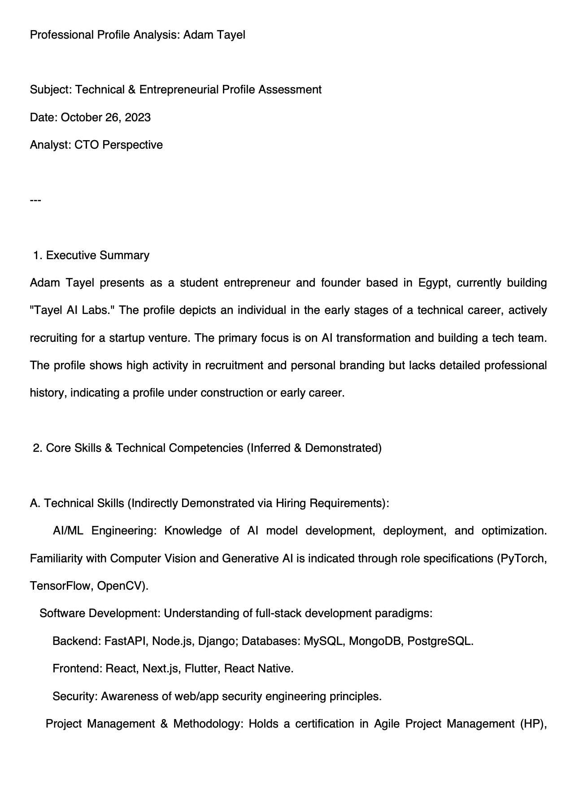

# Project Architecture & Features
Intelligent Profile Extraction: Powered by Bright Data's Scraping Browser to bypass LinkedIn's anti-scraping mechanisms safely.

Advanced AI Analysis: Integrated with DeepSeek-V3 (via OpenAI SDK) for high-precision professional reporting and skill gap analysis.

Automated PDF Generation: Built-in engine to transform AI insights into professional, shareable PDF reports.

Modern Web Interface: A sleek, dark-themed UI built with Streamlit for a premium user experience.

Production-Ready: Fully containerized logic with environment variable protection and asynchronous execution.

# Tech Stack
Core Logic: Python 3.12+

Web Scraping: Playwright & Bright Data Scraping Browser (CDP Integration).

AI Models: DeepSeek-V3 (LLM) for natural language reasoning.

Frontend: Streamlit (Interactive Web Framework).

Document Processing: FPDF for dynamic PDF generation.

Environment Management: python-dotenv for secure credential handling.

Deployment: Streamlit Cloud with GitHub CI/CD integration.

